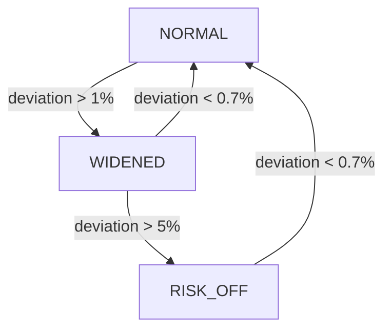

# Omnichain LVR-Shielded LP Vault for Uniswap v4

A Uniswap v4 Hook implementation that provides dynamic liquidity positioning to protect LPs from Loss-Versus-Rebalancing (LVR) through automated risk management modes.

## Overview

This project implements a sophisticated liquidity management system that monitors price movements and automatically adjusts liquidity positions across three risk modes to minimize impermanent loss and LVR exposure. Built for the ETHGlobal NYC 2025 hackathon.

## Live Deployment

**Unichain Sepolia**
- Vault: [`0x84a4871295867f587B15EAFF82e80eA2EbA79a6C`](https://sepolia.uniscan.xyz/address/0x84a4871295867f587B15EAFF82e80eA2EbA79a6C)
- Hook: [`0x20c519Cca0360468C0eCd7A74bEc12b9895C44c0`](https://sepolia.uniscan.xyz/address/0x20c519Cca0360468C0eCd7A74bEc12b9895C44c0)
- Oracle: [`0xf406Cf48630FFc810FCBF1454d8F680a36D1AF64`](https://sepolia.uniscan.xyz/address/0xf406Cf48630FFc810FCBF1454d8F680a36D1AF64)
- Factory: [`0x45ad11A2855e010cd57C8C8eF6fb5A15e15C6b7A`](https://sepolia.uniscan.xyz/address/0x45ad11A2855e010cd57C8C8eF6fb5A15e15C6b7A)

## Features

### Core Functionality

- **Uniswap v4 BaseHook Integration**: Full implementation with permission bits `0x04C0` (BEFORE_SWAP, AFTER_SWAP, AFTER_ADD_LIQUIDITY)
- **Three Risk Modes**:
  - `NORMAL`: Standard liquidity provision with tight ranges
  - `WIDENED`: 2x wider ranges when volatility increases (>1% deviation)
  - `RISK_OFF`: 3x wider ranges for maximum protection (>5% deviation)
- **EWMA Price Tracking**: Exponentially weighted moving average with configurable alpha (2%)
- **Volatility Calculation**: Real-time sigma calculation using 20-tick rolling window
- **Intelligent Reentry**: HOME vs RECENTER decision logic when returning to NORMAL mode

### Protection Mechanisms

1. **Freshness Gate**: Ensures oracle prices are recent (60s max staleness)
2. **Hysteresis**: Lower exit threshold (0.7%) prevents mode flapping
3. **Dwell Time**: Minimum 5 minutes in a mode before transitions
4. **Confirmation Count**: Requires 3 consecutive signals before mode change
5. **Minimum Flip Interval**: 10-minute cooldown between mode changes

## Architecture

```
┌─────────────────┐
│   PoolManager   │
└────────┬────────┘
         │
    ┌────▼────┐
    │  Hook   │◄──── Permission bits: 0x04C0
    └────┬────┘      (mined via CREATE2)
         │
    ┌────▼────┐
    │  Vault  │◄──── Mode updates & telemetry
    └─────────┘
         │
    ┌────▼────┐
    │ Oracle  │◄──── Price feeds (mock/Pyth)
    └─────────┘
```

## Installation

```bash
# Clone repository
git clone https://github.com/yourusername/omnichain-lvr-shielded-lp-vault.git
cd omnichain-lvr-shielded-lp-vault

# Install dependencies
forge install

# Build contracts
forge build

# Run tests (14/14 passing)
forge test -vv
```

## Configuration

### LVR Parameters

```solidity
struct LVRConfig {
    uint16 widenBps;           // 100 = 1% threshold for WIDENED
    uint16 riskOffBps;         // 500 = 5% threshold for RISK_OFF
    uint16 exitThresholdBps;   // 70 = 0.7% hysteresis threshold
    uint32 dwellSec;           // 300 = 5 min minimum dwell
    uint8 confirmations;       // 3 consecutive signals required
    uint32 minFlipInterval;    // 600 = 10 min between flips
    int24 homeToleranceTicks;  // 100 ticks from home
    uint32 homeTtlSec;         // 3600 = 1 hour home TTL
    uint16 kTimes10;           // 15 = 1.5x sigma multiplier
    int24 minTicks;            // 50 minimum half-width
    int24 maxTicks;            // 500 maximum half-width
}
```

## Usage

### Deploy Contracts

```bash
# Set environment
export PRIVATE_KEY=<your-key>
export RPC_URL=https://sepolia.unichain.org

# Deploy all contracts
forge script script/DeployUnichain.s.sol:DeployUnichain \
  --fork-url $RPC_URL --broadcast --legacy -vv
```

### Interact with Hook

```bash
# Check current configuration
cast call $HOOK "cfg()(uint16,uint16,uint16,uint32,uint8,uint32,int24,uint32,uint16,int24,int24)" \
  --rpc-url $RPC_URL

# Update LVR parameters (admin only)
cast send $HOOK "setLVRConfig(uint16,uint16,uint32)" \
  100 500 300 \
  --private-key $PRIVATE_KEY --rpc-url $RPC_URL

# Trigger demo mode change
cast send $HOOK "adminApplyModeForDemo(bytes32,uint8,uint64,string,int24,int24)" \
  $POOL_ID 1 2 "demo" 100 200 \
  --private-key $PRIVATE_KEY --rpc-url $RPC_URL
```

### Monitor Events

```solidity
// Mode transitions
event ModeChanged(PoolId indexed poolId, Mode oldMode, Mode newMode, uint64 epoch, string reason);

// Price signals
event Signal(PoolId indexed poolId, int24 spotTick, int24 ewmaTick, uint24 sigmaTicks);

// Home placement recording
event HomeRecorded(PoolId indexed poolId, int24 centerTick, int24 halfWidthTicks);

// Reentry decisions
event ReentryDecision(PoolId indexed poolId, bool useHome, int24 centerTick, int24 halfWidthTicks);
```

## Testing

```bash
# Run all tests
forge test

# Run with verbosity
forge test -vvv

# Run specific test
forge test --match-test testModeTransitionGates

# Gas report
forge test --gas-report
```

### Test Coverage

- `LVRShieldHook.t.sol`: Hook permissions, config, mode transitions
- `VaultKeeper.t.sol`: Vault access control, keeper functions
- `VaultIntegration.t.sol`: Hook-Vault integration

## Mode Transition Logic



### Placement Calculation

1. **NORMAL Mode**:
   - Check if HOME position exists and is valid
   - If yes: use HOME placement
   - If no: RECENTER on current EWMA
   - Width = 1.5 × sigma

2. **WIDENED Mode**:
   - Center on EWMA
   - Width = 3.0 × sigma

3. **RISK_OFF Mode**:
   - Center on EWMA
   - Width = 4.5 × sigma

## API Reference

### Hook Functions

```solidity
// Admin functions
function setLVRConfig(uint16 widenBps, uint16 riskOffBps, uint32 minFlipInterval)
function setAdvancedConfig(...)
function setPoolOracle(PoolId poolId, bytes32 oracleId)

// Demo function (admin only)
function adminApplyModeForDemo(
    PoolId poolId,
    IVault.Mode mode,
    uint64 epoch,
    string calldata reason,
    int24 centerTick,
    int24 halfWidthTicks
)

// View functions
function cfg() returns (LVRConfig)
function poolStates(PoolId) returns (PoolState)
function poolOracles(PoolId) returns (bytes32)
```

### Vault Functions

```solidity
// Mode application (Hook only)
function applyMode(
    bytes32 poolId,
    Mode mode,
    uint64 epoch,
    string calldata reason,
    int24 optCenterTick,
    int24 optHalfWidthTicks
)

// Keeper functions
function keeperRebalance(...)

// View functions
function getHome(bytes32 poolId) returns (int24 centerTick, int24 halfWidthTicks)
```

## Demo Transactions

View executed mode transitions on Unichain Sepolia:

1. [Initial deployment and config](https://sepolia.uniscan.xyz/tx/0x9ad9d84fe5c1817d514c4b60c16ee47234a39f4ffff1e4060c72dcbd121fbcdc)
2. [NORMAL → WIDENED transition](https://sepolia.uniscan.xyz/tx/0x00f87c1d2402f22e12e4b574a53fa5af9aa069b1524f5cf61e342d02d4f9a67f)
3. [WIDENED → RISK_OFF transition](https://sepolia.uniscan.xyz/tx/0x83492b182dae9449fdf810e39f0cec191950019da6dcff80018aa6a3330761a4)

## Security Considerations

- Hook has `onlyAdmin` modifiers for configuration changes
- Vault enforces `onlyHook` for mode updates
- Oracle staleness checks prevent stale price exploitation
- Multiple eligibility gates prevent rapid mode changes
- Hysteresis prevents mode flapping

## Gas Optimization

- Minimal storage writes (pack structs where possible)
- Circular buffer for tick history (fixed size)
- Single SSTORE for mode transitions
- Efficient bit manipulation for permission flags

## Future Enhancements

- [ ] LayerZero v2 integration for cross-chain mode broadcasting
- [ ] Subgraph for indexing events and analytics
- [ ] Dynamic fee adjustment based on mode
- [ ] Multi-oracle aggregation
- [ ] Keeper automation via Chainlink/Gelato
- [ ] UI dashboard for monitoring positions

## License

MIT

## Acknowledgments

Built for ETHGlobal NYC 2025, targeting Uniswap v4 Hook prize track.